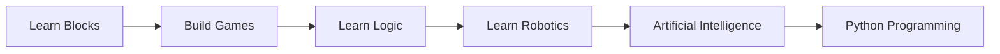

---

## title: Lesson 01 - Introduction to PictoBlox

# 📘 Lesson 01: Introduction to PictoBlox

> **Track:** PictoBlox
> **Module:** Module 01 – PictoBlox Foundations
> **Duration:** ~45–60 minutes
> **Difficulty:** 🟢 Beginner

---

## 🎯 Learning Objectives

By the end of this lesson, you will be able to:

* [ ] Explain what PictoBlox is and why it is used.
* [ ] Differentiate between the Web and Desktop versions of PictoBlox.
* [ ] Access and set up PictoBlox on your computer.
* [ ] Create your first PictoBlox project.
* [ ] Save and reopen a project successfully.

!!! info "Why Does This Matter?"

```
PictoBlox is used worldwide to teach coding, robotics, artificial intelligence, and STEM education. Learning the platform is your first step toward creating games, animations, AI applications, and robots.
```

---

## 🧠 What is PictoBlox?

PictoBlox is a visual programming platform that allows you to create programs using **drag-and-drop blocks** instead of typing code.

It is designed for beginners who want to learn programming, robotics, artificial intelligence, machine learning, and Internet of Things (IoT) concepts in a fun and interactive way.

As your skills grow, PictoBlox also lets you transition from block-based programming to Python programming.

---

## 🌍 Real-World Analogy

!!! example "Think of PictoBlox Like LEGO"

```
Imagine you have a box of LEGO bricks.

Each LEGO brick has a specific purpose. One brick alone cannot build much, but when many bricks are connected together, they create something amazing.

PictoBlox works the same way. Each programming block performs one task, and by connecting blocks together, you can build games, animations, robots, and AI projects.
```

---

## 🚀 What Can You Build with PictoBlox?

Using PictoBlox, you can create:

* 🎮 Games
* 🎨 Animations
* 🤖 Robotics Projects
* 🧠 Artificial Intelligence Applications
* 📷 Computer Vision Projects
* 🌐 IoT Systems
* 📊 Simulations
* 🏫 School STEM Projects

### Learning Journey



---

## 💡 Why Learn PictoBlox?

PictoBlox makes programming easier because:

* No typing syntax is required.
* Blocks snap together like puzzle pieces.
* Programming concepts become easier to understand.
* Supports both block coding and Python.
* Can control robots and electronic devices.
* Includes AI and Machine Learning features.

!!! tip

```
Many professional programmers started learning through visual programming platforms before moving to languages such as Python, JavaScript, and C++.
```

---

# 🌐 Two Ways to Use PictoBlox

PictoBlox can be used in two different ways:

1. Web Version
2. Desktop Version

---

## 1️⃣ Web-Based PictoBlox

The web version runs directly inside your browser.

### Advantages

* No installation required
* Accessible from any computer
* Quick and easy to start
* Great for beginners

### Steps to Access

1. Open your web browser.

2. Visit:

   https://pictoblox.ai

3. Click **Start Coding**.

4. Begin creating projects.

!!! success

```
If you're using a school computer or a shared computer, the web version is usually the fastest option.
```

---

## 2️⃣ Desktop PictoBlox

The desktop version is installed on your computer.

### Advantages

* Better performance
* Works offline
* Full robotics support
* Better hardware integration
* Recommended for long-term learning

### Installation Steps

1. Visit:

   https://pictoblox.ai/download-pictoblox

2. Select your operating system:

   * Windows
   * macOS
   * Linux

3. Download the installer.

4. Run the installer.

5. Follow the installation wizard.

6. Launch PictoBlox.

---

## ⚖️ Web vs Desktop Comparison

| Feature               | Web Version | Desktop Version  |
| --------------------- | ----------- | ---------------- |
| Installation Required | ❌           | ✅                |
| Internet Required     | ✅           | ❌                |
| Offline Use           | ❌           | ✅                |
| Robotics Support      | Limited     | Full             |
| AI Projects           | ✅           | ✅                |
| Performance           | Good        | Better           |
| Recommended For       | Beginners   | Serious Projects |

---

# 🛠️ Your First PictoBlox Project

Let's create our first program.

## Goal

Make a sprite display a welcome message when the green flag is clicked.

---

### Step 1 — Open PictoBlox

Launch either:

* Web Version
* Desktop Version

You should see the default Cat Sprite.

---

### Step 2 — Find the Events Category

Locate the **Events** category in the Block Palette.

Drag the block:

```text
when green flag clicked
```

into the coding area.

---

### Step 3 — Find the Looks Category

Locate the **Looks** category.

Drag:

```text
say [Hello!]
```

and connect it below the Events block.

Your program should look like:

```text
when green flag clicked
    say [Hello!]
```

---

### Step 4 — Run the Program

Click the 🟢 Green Flag.

Expected Result:

```text
Hello!
```

The sprite will display the message on the stage.

---

## 🏋️ Hands-On Exercise

### Exercise: Introduce Yourself

Create a program that introduces you.

### Requirements

* Use the Green Flag event.
* Display your name.
* Display your favorite hobby.
* Use at least two Say blocks.

### Example Output

```text
Hello!
My name is Mohan.
I enjoy coding.
```

---

<details>
<summary>💡 Hint</summary>

Use multiple **Say** blocks connected one after another.

</details>

---

## 🔥 Challenge Task

### Create a Welcome Screen

Display:

* Your name
* Your city
* Your favorite subject
* A fun fact

Example:

```text
Welcome!
My name is Alex.
I live in Kathmandu.
I love building robots.
```

### Bonus Challenge

* Change the sprite.
* Add a backdrop.
* Add a sound effect.

---

## 🧪 Quick Quiz

### 1. What type of programming does PictoBlox primarily use?

* a) Assembly
* b) Binary
* c) Block-Based Programming
* d) Machine Language

### 2. Which version of PictoBlox requires installation?

* a) Web Version
* b) Desktop Version
* c) Both
* d) Neither

### 3. What does the Green Flag do?

* a) Save Project
* b) Start Program
* c) Delete Sprite
* d) Close Project

### 4. True or False

PictoBlox can be used for robotics projects.

### 5. Name two things you can create using PictoBlox.

---

<details>
<summary>✅ Answer Key</summary>

1. c) Block-Based Programming
2. b) Desktop Version
3. b) Start Program
4. True
5. Games, Animations, AI Projects, Robotics Projects, IoT Projects

</details>

---

## 🌐 Real-World Connection

PictoBlox is used in schools, coding clubs, robotics competitions, STEM laboratories, and educational programs worldwide.

The logic you learn in PictoBlox is the same logic used in professional programming languages such as Python, JavaScript, Java, and C++.

---

## 📝 Lesson Summary

| Concept                 | Meaning                         |
| ----------------------- | ------------------------------- |
| PictoBlox               | Visual Programming Platform     |
| Sprite                  | Character inside a project      |
| Block-Based Programming | Programming using visual blocks |
| Web Version             | Browser-based PictoBlox         |
| Desktop Version         | Installed PictoBlox software    |
| Green Flag              | Starts the program              |

### Key Takeaways

* 📌 PictoBlox makes coding easier through visual blocks.
* 📌 You can use either the Web or Desktop version.
* 📌 PictoBlox supports coding, robotics, and AI projects.
* 📌 You created your first working PictoBlox program.

---

## ➡️ What's Next?

In **Lesson 02**, you'll explore the complete PictoBlox interface, including:

* Stage
* Sprites
* Coding Area
* Block Palette
* Toolbar
* Project Management

Before moving on:

* [ ] I completed the exercise
* [ ] I attempted the challenge
* [ ] I understand what PictoBlox is
* [ ] I can access PictoBlox successfully

---

*Lesson 01 of 07 · PictoBlox Foundations · CodeCraft Learning Lab*
