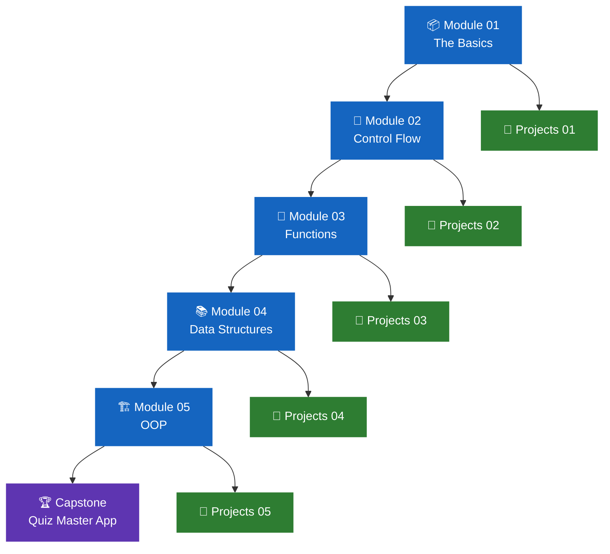

# 🐍 Python Programming

> **Track:** Python · **Level:** Beginner → Intermediate · **Modules:** 5

Python is the world's most popular programming language — used in web
development, data science, AI, robotics, and automation. This track
takes you from writing your very first line of code all the way to
building real applications using Object-Oriented Programming.

[🚀 Start Module 01](module-01-basics/){ .md-button .md-button--primary }
[📋 View All Projects](module-01-basics/projects/){ .md-button }

---

## Track Roadmap



---

## All Modules

<div class="grid cards" markdown>

-   📦 **Module 01 — The Basics**

    ---

    The foundation of everything. You will understand how Python
    thinks about information and how to communicate with users.

    **Lessons:**

    - Lesson 01 — Welcome to Python
    - Lesson 02 — Variables, Data Types & I/O
    - Lesson 03 — Operators & Expressions

    **Projects:** Personal Profile Card · Report Card ·
    Bill Calculator · Capstone

    **Status:** ✅ Complete

    [:octicons-arrow-right-24: Open Module 01](module-01-basics/)

-   🔀 **Module 02 — Control Flow**

    ---

    Teach Python to make decisions and repeat actions.
    The tools that make programs truly intelligent.

    **Lessons coming:**

    - if · elif · else statements
    - Comparison and logical operators
    - for loops and range()
    - while loops · break · continue

    **Status:** 🚧 Coming Soon

    [:octicons-arrow-right-24: Open Module 02](module-02-control-flow/)

-   🔧 **Module 03 — Functions**

    ---

    Stop repeating yourself. Learn to write reusable blocks
    of code that make your programs clean and scalable.

    **Lessons coming:**

    - Defining and calling functions
    - Parameters, arguments, return values
    - Default parameters · scope
    - Lambda functions

    **Status:** 📅 Planned

    [:octicons-arrow-right-24: Open Module 03](module-03-functions/)

-   📚 **Module 04 — Data Structures**

    ---

    Store, organise, and manipulate collections of data
    using Python's most powerful built-in structures.

    **Lessons coming:**

    - Lists — indexing, slicing, methods
    - Dictionaries — keys, values, iteration
    - Tuples and Sets
    - List comprehensions

    **Status:** 📅 Planned

    [:octicons-arrow-right-24: Open Module 04](module-04-data-structures/)

-   🏗️ **Module 05 — OOP**

    ---

    Object-Oriented Programming — the foundation of
    professional software development worldwide.

    **Lessons coming:**

    - Classes and objects
    - `__init__` and instance methods
    - Inheritance and `super()`
    - Encapsulation and abstraction

    **Status:** 📅 Planned

    [:octicons-arrow-right-24: Open Module 05](module-05-oop/)

</div>

---

## What You Will Build

!!! success "Projects after every module — a capstone at the end"

    | Module | Mini Projects | Capstone |
    |--------|--------------|----------|
    | 01 — Basics | Profile Card · Report Card · Bill Calculator | Profile Generator App |
    | 02 — Control Flow | Grade Checker · BMI Calculator · Login System | Smart Quiz Game |
    | 03 — Functions | Converter · Calculator · Text Analyser | Modular Utility Toolkit |
    | 04 — Data Structures | Contact Book · Word Counter · Shopping Cart | Student Database |
    | 05 — OOP | Animal Class · Bank Account · Todo App | **Quiz Master Application** |

---

## Skills You Will Gain

=== "Module 01"

    | Skill | What you learn |
    |---|---|
    | Variables | Store and update data |
    | Data types | `int` `float` `str` `bool` |
    | `input()` | Get data from the user |
    | `print()` | Display formatted output |
    | Operators | Arithmetic, comparison, logical, assignment |
    | Typecasting | Convert between data types |
    | String methods | `upper()` `split()` `replace()` `len()` |

=== "Module 02"

    | Skill | What you learn |
    |---|---|
    | `if / elif / else` | Make decisions |
    | Comparison operators | `==` `!=` `>` `<` `>=` `<=` |
    | Logical operators | `and` `or` `not` |
    | `for` loop | Repeat a known number of times |
    | `while` loop | Repeat while a condition is true |
    | `break / continue` | Control loop flow |
    | `range()` | Generate number sequences |

=== "Module 03"

    | Skill | What you learn |
    |---|---|
    | `def` | Define reusable functions |
    | Parameters | Pass data into functions |
    | `return` | Get data back from functions |
    | Default values | Optional parameters |
    | Scope | Local vs global variables |
    | Lambda | One-line anonymous functions |

=== "Module 04"

    | Skill | What you learn |
    |---|---|
    | Lists | Ordered collections |
    | Dictionaries | Key-value storage |
    | Tuples | Immutable sequences |
    | Sets | Unique value collections |
    | Comprehensions | Clean one-line loops |
    | Nesting | Data structures inside each other |

=== "Module 05"

    | Skill | What you learn |
    |---|---|
    | Classes | Blueprint for objects |
    | Objects | Instances of a class |
    | `__init__` | Constructor method |
    | Methods | Functions inside classes |
    | Inheritance | Reuse and extend classes |
    | Encapsulation | Hide internal details |

---

## Setup

!!! info "What you need before starting"

    === "Online (Replit)"

        No installation. Start in 2 minutes.

        1. Go to [replit.com](https://replit.com)
        2. Sign up free
        3. Create a new Python repl
        4. Start coding

    === "Offline (VS Code)"

        Professional setup. Takes ~15 minutes.

        1. Download [Python 3](https://www.python.org/downloads/)
        2. Download [VS Code](https://code.visualstudio.com)
        3. Install the Python extension by Microsoft
        4. Create a `.py` file and start coding

        ```bash
        # Verify Python is installed
        python --version
        # Expected: Python 3.x.x
        ```

---

## How to Progress

!!! abstract "The rule for this track"

    ```
    Read lesson → Run the code → Do the exercise
         → Attempt the challenge → Build the mini project
              → Move to next lesson
                   → After all lessons: build the capstone
                        → Move to next module
    ```

    **Never skip a lesson.** Each one builds directly on the previous.
    **Never skip a project.** Projects are where real learning happens.

---

*Python Track · Code & Core Learning System*