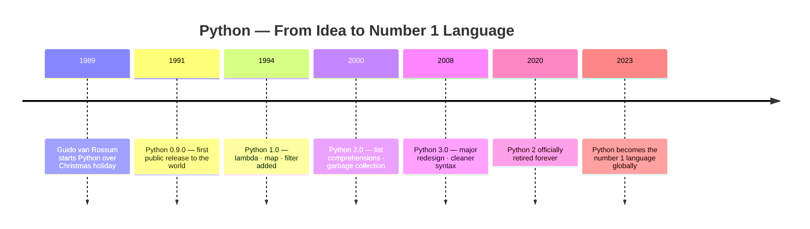
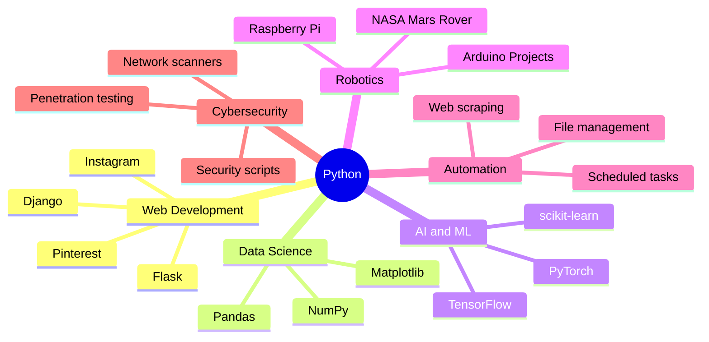

# Lesson 01 — Welcome to Python

<div class="grid cards" markdown>

-   ⏱️ **Duration**

    60 minutes

-   🎯 **Track**

    Python — Module 01

-   📊 **Difficulty**

    🟢 Beginner

-   📦 **Requires**

    Nothing — start from zero

</div>

---

## 🎯 Learning Objectives

!!! success "By the end of this lesson you will be able to:"

    - [x] Explain what Python is, where it came from, and why it matters
    - [x] List at least 5 real-world applications of Python
    - [x] Set up a Python environment using VS Code or Replit
    - [x] Write and run your first Python program using `print()`

---

## 🧠 What is Python?

Python is a **high-level, general-purpose programming language** — designed
to be easy for humans to read and write, and powerful enough to build
almost anything: websites, games, robots, AI systems, and more.

Unlike older languages that look like machine instructions, Python reads
almost like plain English. That is not an accident — it was designed
that way on purpose.

!!! quote "The Philosophy"
    *"Beautiful is better than ugly. Simple is better than complex.
    Readability counts."*

    — Tim Peters, The Zen of Python (`import this`)

---

## 🕰️ History & Development

### The Origin Story

In the late 1980s, a Dutch programmer named **Guido van Rossum** was
working at a research institute in the Netherlands called CWI. He worked
with a language called ABC but found it too limiting.

During the **Christmas holiday of 1989**, with time on his hands, he
started building something new — a language that fixed ABC's problems
and was genuinely enjoyable to use.

!!! info "Why the name Python?"
    Guido was a fan of **Monty Python's Flying Circus** — a British
    comedy show. The name has nothing to do with the snake. 🎭

    He later wrote: *"I chose Python as a working title, being in a
    slightly irreverent mood."*

### Timeline



!!! warning "Always use Python 3"
    Python 2 was retired in 2020. It receives **no updates and no
    security fixes**. Never start a new project in Python 2.

## 🎬 Watch — Python in 100 Seconds

<div class="video-wrapper" markdown>
<iframe
  width="100%"
  height="415"
  src="https://www.youtube.com/embed/x7X9w_GIm1s"
  title="Python in 100 Seconds — Fireship"
  frameborder="0"
  allow="accelerometer; autoplay; clipboard-write; encrypted-media; gyroscope; picture-in-picture"
  allowfullscreen>
</iframe>
</div>

!!! info "About this video"
    A fast, visual overview of Python by Fireship — great for
    reinforcing what you just read.

### The Philosophy Behind Python

Guido had a clear vision: Python should be simple, readable, and fun.
He captured this in **The Zen of Python** — a set of guiding principles.
Read them anytime by typing this into Python:

```python
import this
```

The most important lines:

- *"Beautiful is better than ugly."*
- *"Simple is better than complex."*
- *"Readability counts."*

---

## ⭐ Key Features

!!! abstract "What makes Python different"

    | Feature | What it means for you |
    |---|---|
    | **Easy to read** | Code looks like plain English sentences |
    | **Free & open source** | Download and use forever — no cost ever |
    | **Interpreted** | Runs line by line — no separate compile step |
    | **Cross-platform** | Works on Windows, Mac, Linux, Raspberry Pi |
    | **Huge standard library** | Thousands of built-in tools ready to use |
    | **Large community** | Millions of developers, tutorials, free help |
    | **Versatile** | One language for web, AI, robotics, and more |
    | **Beginner-friendly** | Ranked the best first programming language |

---

## 🤔 Why Learn Python?

**1. Fastest path from idea to working code**
Python lets you do in 5 lines what takes 20 lines in other languages.
You spend less time fighting syntax and more time solving real problems.

**2. The job market demands it**
Python developers are among the highest-paid in tech. Data science,
AI/ML, and automation roles are almost entirely Python-based.

**3. Used in the most exciting fields**
Artificial intelligence, robotics, space exploration, medical research
— Python is at the centre of all of it right now.

**4. Scales from beginner to expert**
You can write your first program today and still be discovering new
things about Python 10 years from now.

---

## 🌍 Real-World Applications



!!! example "Real organisations using Python"

    | Organisation | How they use Python |
    |---|---|
    | **NASA** | Mars rover operations and telescope data processing |
    | **Instagram** | Entire backend — serves 1 billion+ users daily |
    | **Netflix** | Recommendation algorithm — suggests what to watch |
    | **CERN** | Particle physics data from the Large Hadron Collider |
    | **Google** | Internal tools, YouTube, and core infrastructure |

---

## 💻 Choosing Your Editor

Before writing Python, you need a place to write and run it.
An **IDE (Integrated Development Environment)** is that place —
think of it like a fully equipped kitchen for coding.

!!! tip "Which should I use?"
    - Use **Replit** if you want to start in the next 2 minutes
    - Use **VS Code** if you want a professional offline setup
    - Both are valid — learn both below and pick what fits you today

=== "🌐 Replit (Online)"

    **Setup time: ~2 minutes. Needs only a browser.**

    ---

    **Step 1 — Create a free account**

    Go to [replit.com](https://replit.com) and click **Sign Up**.
    Enter your email, choose a password, verify your email, log in.

    ---

    **Step 2 — Create your first project**

    1. Click **+ Create Repl**
    2. Search for `Python` in the template list
    3. Select **Python**
    4. Name it: `code-core-python`
    5. Click **Create Repl**

    ---

    **Step 3 — Understand the interface**

    | Panel | Purpose |
    |-------|---------|
    | Left | File explorer — your project files |
    | Centre | Code editor — write your code here |
    | Right | Console — output appears here when you run |

    ---

    **Step 4 — Run your first program**

    In the centre panel, type:

    ```python
    print("Hello, World!")
    print("I am learning Python!")
    ```

    Click the green **▶ Run** button.

    You should see the output on the right panel immediately. ✅

=== "🖥️ VS Code (Offline)"

    **Setup time: ~15 minutes. Works without internet after setup.**

    ---

    **Step 1 — Install Python**

    Go to [python.org/downloads](https://www.python.org/downloads/)
    and click the big yellow **Download Python 3.x.x** button.

    Run the installer.

    !!! danger "Windows — critical step"
        On the installer's **first screen**, tick the checkbox:
        **"Add Python to PATH"** — before clicking Install Now.
        Skipping this breaks everything and is the #1 beginner mistake.

    Verify installation — open your terminal and run:

    ```bash
    python --version
    ```

    Expected output:
    ```
    Python 3.12.0
    ```

    If you see a version number — Python is installed. ✅

    ---

    **Step 2 — Install VS Code**

    Go to [code.visualstudio.com](https://code.visualstudio.com) and
    download for your operating system. Run the installer with all
    default settings.

    ---

    **Step 3 — Install the Python Extension**

    1. Open VS Code
    2. Click the **Extensions icon** in the left sidebar (four squares)
    3. Search: `Python`
    4. Click **Python by Microsoft** → Click **Install**
    5. Wait ~30 seconds

    ---

    **Step 4 — Create your project folder**

    1. Create a folder on your desktop named `code-core-python`
    2. In VS Code: **File → Open Folder** → Select that folder
    3. Click the **New File** icon → Name it `lesson01.py`

    ---

    **Step 5 — Run your file**

    Type your code in the editor, then open the terminal:
    **Terminal → New Terminal** and run:

    ```bash
    python lesson01.py
    ```

    ---

    **VS Code interface at a glance:**

    ```
    ┌─────────────┬──────────────────┬─────────────────┐
    │ Activity Bar│   Editor Area    │    Terminal      │
    │  (left side)│ (write code here)│ (output appears) │
    │             │                  │                  │
    │ 📁 Explorer │  lesson01.py     │ $ python ...     │
    │ 🔍 Search   │                  │ Hello, World!    │
    │ 🧩 Exts     │  print("Hello")  │                  │
    └─────────────┴──────────────────┴─────────────────┘
    ```

---

## 🛠️ Your First Program

Create a new file called `lesson01.py` and type this **exactly**
— do not copy-paste. Typing builds muscle memory.

```python title="lesson01.py" linenums="1"
# ================================
# My First Python Program
# ================================

print("Hello, World!")               # (1)
print("My name is [YOUR NAME]")      # (2)
print("I am learning Python!")       # (3)
```

1. `print()` displays text on the screen. Text must always be inside quotes.
2. Replace `[YOUR NAME]` with your actual name before running.
3. Every `print()` call outputs on its own new line automatically.

**Expected output:**

```
Hello, World!
My name is Arjun
I am learning Python!
```

!!! example "Try this"
    Add a fourth `print()` line that outputs your city name.
    Run it again. What changes in the output?

---

## 🏋️ Practice Exercise

!!! question "Exercise — My Python Introduction"

    Write a Python program with **at least 5 `print()` statements**
    that produces this output using your own real information:

    ```
    =============================
           MY INTRODUCTION
    =============================
    Name    : Arjun Sharma
    Age     : 14
    City    : Kathmandu, Nepal
    Hobby   : Playing football
    Goal    : Build a robot with Python
    =============================
    ```

    **Requirements:**

    - Border lines at top and bottom
    - Each piece of information on its own line
    - Labels aligned using spaces inside the quotes

    ??? tip "Hint — click to reveal"
        Use `print("=" * 29)` to generate the border automatically.
        Python repeats the `=` character 29 times for you.

        Each data line looks like:
        ```python
        print("Name    : Arjun Sharma")
        ```
        Just add spaces between the label and `:` to align them.

---

## 🔥 Challenge

!!! danger "Challenge — The Formatted Story"

    Write a program that prints a short personal story.

    **Requirements:**

    - A title inside a box built from `=` characters
    - At least 5 lines of story content
    - Sections separated by blank `print()` lines
    - At least one line using string repetition like `print("-" * 30)`

    **Example structure:**
    ```
    ==============================
          MY CODING STORY
    ==============================

    My name is Arjun. I live in Kathmandu, Nepal.
    I am 14 years old and I love technology.

    ------------------------------

    I started learning Python because I want to
    build robots and AI systems one day.

    ==============================
    ```

    **Extension ideas:**

    - Make the title box with `|` sides: `|   MY STORY   |`
    - Add a "Chapter 1" heading line before your story
    - Use `print()` to draw a simple picture using characters

---

## 🧪 Quick Quiz

!!! question "Test yourself — no looking back at the lesson"

    **1.** Who created Python and when did development begin?

    - A) Bill Gates, 1995
    - B) Guido van Rossum, 1989
    - C) Linus Torvalds, 1991
    - D) James Gosling, 1985

    ---

    **2.** Where does the name "Python" come from?

    - A) The snake — because Python is fast and powerful
    - B) Monty Python's Flying Circus — a British comedy show
    - C) An ancient Greek mathematician named Python
    - D) An acronym for a long technical phrase

    ---

    **3.** Which of these is NOT a real application of Python?

    - A) Building websites with Django or Flask
    - B) Training AI and machine learning models
    - C) Designing hardware microchips
    - D) Automating repetitive file management tasks

    ---

    **4.** True or False: You should use Python 2 for new projects
    because it has been around longer and is more stable.

    ---

    **5.** What terminal command verifies that Python is installed
    correctly on your computer?

    ??? success "Answer Key — click to reveal"

        | # | Answer | Explanation |
        |---|--------|-------------|
        | 1 | **B** | Guido van Rossum started Python during Christmas 1989 |
        | 2 | **B** | Named after the comedy show — Guido was a fan |
        | 3 | **C** | Chip design uses hardware languages like VHDL or Verilog |
        | 4 | **False** | Python 2 retired 2020 — no updates, no security fixes ever |
        | 5 | `python --version` | Prints the installed version number to the terminal |

---

## 🌐 Real-World Connection

When you learn Python, you are not learning a toy language.
You are picking up the same tool used by:

- Engineers at **NASA** planning missions to Mars
- Developers at **Instagram** serving a billion users every day
- Scientists at **CERN** analysing the fundamental particles of matter
- Researchers building the AI systems that will shape the next decade

Python is everywhere — and it starts with exactly what you just did:
`print("Hello, World!")`.

---

## 📝 Lesson Summary

| Concept | Key Point |
|---|---|
| **Creator** | Guido van Rossum — started Christmas 1989 |
| **Name origin** | Monty Python's Flying Circus — the comedy show |
| **Version to use** | Always Python 3 — Python 2 is retired |
| **`print()`** | Displays text output to the screen |
| **Replit** | Online editor — 2 minute setup, no install |
| **VS Code** | Offline editor — professional standard tool |
| **Key insight** | Python was designed to be readable on purpose |

**Key takeaways:**

- 📌 Python was built to be simple and readable — that is a strength, not a limitation
- 📌 Always use Python 3, never Python 2
- 📌 VS Code = professional offline; Replit = fast online — both are valid
- 📌 `print()` is how Python shows output — your most-used tool for now

---

## ✅ Before Moving On

!!! success "Confirm all four before going to Lesson 02"

    - [x] I have a working Python environment — Replit or VS Code
    - [x] I ran `print("Hello, World!")` and saw the output
    - [x] I completed the Introduction exercise with my own information
    - [x] I can explain what Python is in my own words without reading

---

## ➡️ Next Lesson

**Lesson 02** covers how Python thinks about information —
variables, data types, input, output, and string operations.

[Lesson 02 — Variables & Data :octicons-arrow-right-24:](lesson-02.md)

---

*Lesson 01 of 03 · Python Track · Module 01 — Basics · Code & Core Learning System*