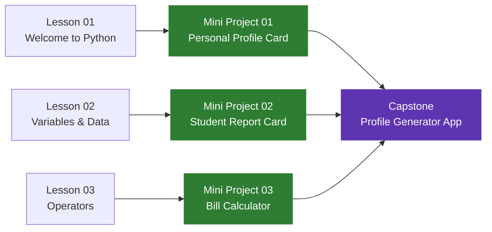

# 🧪 Module 01 — Projects

> **Track:** Python · **Module:** 01 — Basics

This page is your project hub for Module 01.
Complete lessons first, then build the projects in order.

---

## Project Map

---

## Projects in This Module

| Project | After | Difficulty | Status |
|---|---|---|---|
| [Mini 01 — Personal Profile Card](mini-01.md) | Lesson 01 | 🟢 Beginner | ✅ Ready |
| [Mini 02 — Student Report Card](mini-02.md) | Lesson 02 | 🟢 Beginner | ✅ Ready |
| [Mini 03 — Restaurant Bill Calculator](mini-03.md) | Lesson 03 | 🟢 Beginner | ✅ Ready |
| [Capstone — Profile Generator App](capstone.md) | All 3 Lessons | 🟡 Intermediate | ✅ Ready |

---

!!! tip "How to approach projects"
    - Read the problem statement fully before writing a single line
    - Build in stages — get each stage working before moving to the next
    - Test with different inputs — not just the happy path
    - Write comments explaining what each section does