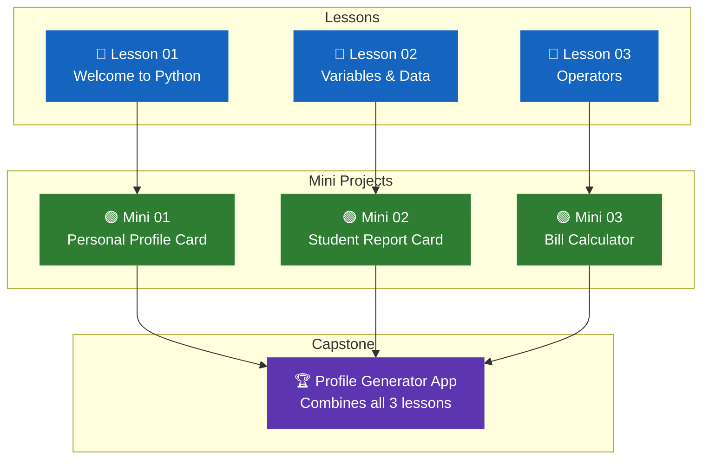

# 🧪 Module 01 — Projects

> **Track:** Python · **Module:** 01 — Basics

Complete the lessons first, then build the projects in order.
Each project uses exactly what you learned in that lesson — nothing more.

---

## Project Roadmap

---

## Projects in This Module

-   🟢 **Mini Project 01**

    ---

    **Personal Profile Card**

    After: Lesson 01 — Welcome to Python

    Use only `print()` and string formatting to build a
    neatly formatted profile card in the terminal.

    **Skills:** `print()` · string repetition · alignment

    [:octicons-arrow-right-24: Build it](mini-01.md)

-   🟢 **Mini Project 02**

    ---

    **Student Report Card**

    After: Lesson 02 — Variables & Data Types

    Collect student scores using `input()`, calculate the
    average, assign a grade, and print a formatted report.

    **Skills:** `input()` · `float()` · f-strings · variables

    [:octicons-arrow-right-24: Build it](mini-02.md)

-   🟢 **Mini Project 03**

    ---

    **Restaurant Bill Calculator**

    After: Lesson 03 — Operators & Expressions

    Take item prices, apply tax and service charge, and
    print a professional aligned receipt.

    **Skills:** Arithmetic operators · f-string alignment · `%` · `**`

    [:octicons-arrow-right-24: Build it](mini-03.md)

-   🏆 **Capstone Project**

    ---

    **Profile Generator App**

    After: All 3 Lessons

    Combines everything from Module 01 — input, output,
    variables, operators, typecasting, and string operations
    into one complete, professional program.

    **Skills:** Everything from Module 01

    [:octicons-arrow-right-24: Build it](capstone.md)

---

## Project Rules

!!! warning "Read before you start"

    | Rule | Why it matters |
    |---|---|
    | Finish the lesson before the project | Projects use lesson skills — don't skip ahead |
    | Build in stages | Get Stage 1 working before Stage 2 |
    | Type the code — don't copy | Typing builds real muscle memory |
    | Test with different inputs | One working example is not enough |
    | Add comments to your code | Explains your thinking to others (and future you) |

---

## Skills Used in This Module

!!! abstract "What you practise across all four projects"

    === "Mini Projects"

        | Skill | Mini 01 | Mini 02 | Mini 03 |
        |---|---|---|---|
        | `print()` | ✅ | ✅ | ✅ |
        | `input()` | ❌ | ✅ | ✅ |
        | Variables | ✅ | ✅ | ✅ |
        | `float()` typecasting | ❌ | ✅ | ✅ |
        | f-strings | ❌ | ✅ | ✅ |
        | Arithmetic operators | ❌ | ✅ | ✅ |
        | String methods | ✅ | ❌ | ❌ |
        | Column alignment | ✅ | ✅ | ✅ |

    === "Capstone"

        The capstone uses **all skills** from the three mini projects
        combined into one program:

        - `input()` for data collection
        - `int()` and `float()` for typecasting
        - Arithmetic for average and birth year calculation
        - String methods for name analysis
        - f-strings with alignment for the final report
        - Conditional logic for grade assignment

---

## What to Do After This Module

!!! success "Once all four projects are complete"

    You are ready for **Module 02 — Control Flow**.

    You will learn `if`, `elif`, `else`, `for` loops, `while` loops,
    `break`, `continue`, and `range()` — the tools that make your
    programs make real decisions.

    [Go to Module 02 — Control Flow](../../module-02-control-flow/){ .md-button .md-button--primary }

---

*Module 01 Projects · Python Track · Code & Core Learning System*