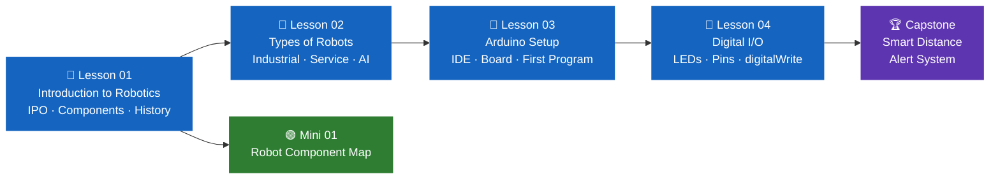

# 🤖 Module 01 — Foundations of Robotics

> **Track:** Robotics · **Duration:** ~4 hours · **Difficulty:** 🟢 Beginner

This module builds your complete foundation in robotics — from understanding
what a robot actually is, to wiring your first Arduino circuit and writing
your first embedded program. No prior experience needed.

[🚀 Start Lesson 01](lesson-01.md){ .md-button .md-button--primary }
[🧪 View Projects](projects/){ .md-button }

---

## Module Roadmap



---

## Lessons

<div class="grid cards" markdown>

-   📘 **Lesson 01 — Introduction to Robotics**

    ---

    Start here. Understand what a robot really is, how it works,
    and where robotics is used in the real world today.

    **You will learn:**

    - What a robot is and its key characteristics
    - The 4 core components — Sensors, Controller, Actuators, Power
    - History and 5 generations of robotics
    - The IPO model — Input → Process → Output
    - Open-loop vs closed-loop control systems

    **Duration:** 60 minutes · **Status:** ✅ Ready

    [:octicons-arrow-right-24: Open Lesson 01](lesson-01.md)

-   📘 **Lesson 02 — Types of Robots**

    ---

    Explore the major categories of robots and how their design
    is shaped entirely by their purpose and environment.

    **You will learn:**

    - Industrial, service, humanoid, and autonomous robots
    - How to classify any robot by its type and use case
    - Real-world examples from manufacturing, healthcare, space
    - Why robots look and move so differently from each other

    **Duration:** 60 minutes · **Status:** 📅 Planned

    [:octicons-arrow-right-24: Open Lesson 02](lesson-02.md)

-   📘 **Lesson 03 — Arduino Setup & First Program**

    ---

    Set up your development environment and write your first
    embedded program — the hardware equivalent of "Hello, World!".

    **You will learn:**

    - What Arduino is and why it is the standard for beginners
    - Installing and navigating the Arduino IDE
    - Understanding the Arduino Uno board and its pins
    - Writing your first sketch — `setup()` and `loop()`
    - Uploading and running a program on real hardware

    **Duration:** 60 minutes · **Status:** 📅 Planned

    [:octicons-arrow-right-24: Open Lesson 03](lesson-03.md)

-   📘 **Lesson 04 — Digital I/O & LED Control**

    ---

    Control real hardware for the first time — turn LEDs on and
    off, understand digital pins, and build your first circuit.

    **You will learn:**

    - Digital vs analog signals
    - `pinMode()`, `digitalWrite()`, `delay()`
    - Breadboard wiring and resistor usage
    - Building a multi-LED circuit
    - Reading digital input from a button

    **Duration:** 60 minutes · **Status:** 📅 Planned

    [:octicons-arrow-right-24: Open Lesson 04](lesson-04.md)

</div>

---

## Projects

<div class="grid cards" markdown>

-   🟢 **Mini Project 01 — Robot Component Map**

    ---

    After Lesson 01 · 30 minutes · Beginner

    Map a real robot to the IPO model and identify all four
    of its components. Design your own robot concept.

    [:octicons-arrow-right-24: Build it](projects/mini-01.md)

-   🟢 **Mini Project 02 — LED Blink Circuit**

    ---

    After Lesson 04 · 30 minutes · Beginner

    Build your first Arduino circuit — wire an LED and write
    the code to make it blink. The "Hello, World!" of hardware.

    [:octicons-arrow-right-24: Build it](projects/mini-01.md)

-   🏆 **Capstone — Smart Distance Alert System**

    ---

    After all lessons · 2–3 hours · Intermediate

    Build a complete distance alert system using an ultrasonic
    sensor, tri-color LEDs, and a buzzer — identical to a real
    parking sensor system.

    [:octicons-arrow-right-24: Build it](projects/capstone.md)

</div>

---

## What You Need

!!! info "Hardware & Software Requirements"

    === "Hardware"

        | Component | Quantity | Purpose |
        |---|---|---|
        | Arduino Uno | 1 | The microcontroller brain |
        | USB-A to USB-B cable | 1 | Connect to computer |
        | Breadboard (full size) | 1 | Build circuits without soldering |
        | LEDs (assorted) | 5+ | Output indicators |
        | 220Ω Resistors | 5+ | Protect LEDs from excess current |
        | HC-SR04 Ultrasonic sensor | 1 | Distance measurement (Capstone) |
        | Passive buzzer | 1 | Audio alerts (Capstone) |
        | Jumper wires | 20+ | Connect components |

    === "Software"

        1. **Arduino IDE** — Download free from
           [arduino.cc/en/software](https://www.arduino.cc/en/software)

        2. **USB Driver** — Usually installs automatically.
           Windows users: install CH340 driver if board is not detected.

        3. **Board setup** — In Arduino IDE:
           `Tools → Board → Arduino AVR Boards → Arduino Uno`

        ```
        Verify installation:
        Tools → Port → (your COM port should appear)
        ```

    === "No Hardware Yet?"

        You can still complete **Lesson 01** and **Lesson 02** — these
        are conceptual lessons that require only a pen and paper.

        For circuit lessons, use the free online simulator:
        [Tinkercad Circuits](https://www.tinkercad.com/circuits)

        It simulates Arduino, LEDs, sensors, and breadboards entirely
        in your browser — no hardware needed.

---

## Skills You Will Build

!!! abstract "By the end of Module 01 you will be able to:"

    | Skill | Where you learn it |
    |---|---|
    | Define and classify robots | Lesson 01 |
    | Apply the IPO model to any robotic system | Lesson 01 |
    | Distinguish open-loop vs closed-loop | Lesson 01 |
    | Classify robots by type and application | Lesson 02 |
    | Set up Arduino IDE and connect the board | Lesson 03 |
    | Write and upload a basic Arduino sketch | Lesson 03 |
    | Control LEDs using digital output pins | Lesson 04 |
    | Read digital input from a button | Lesson 04 |
    | Build simple circuits on a breadboard | Lessons 03 & 04 |
    | Build the Smart Distance Alert System | Capstone |

---

## How to Progress Through This Module

!!! warning "Important — read before starting"

    | Step | What to do |
    |---|---|
    | 1 | Read Lesson 01 fully before touching any hardware |
    | 2 | Complete the activity and exercise in each lesson |
    | 3 | Build Mini Project 01 after Lesson 01 |
    | 4 | Set up your Arduino IDE before Lesson 03 |
    | 5 | Build the LED Blink mini project after Lesson 04 |
    | 6 | Build the Capstone only after all 4 lessons are done |

---

## Next Module

!!! success "After completing this module"

    You will have the foundational knowledge and hands-on experience
    to move into **Module 02 — Sensors**, where you will work with
    ultrasonic, IR, and temperature sensors to build responsive systems.

    [Module 02 — Sensors](../module-02-sensors/){ .md-button }

---

*Module 01 · Robotics Track · Code & Core Learning System*