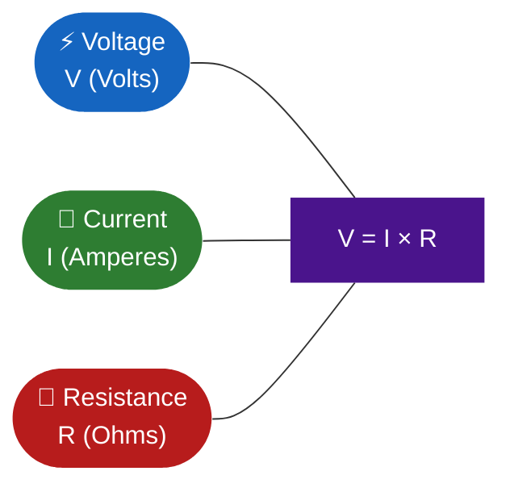
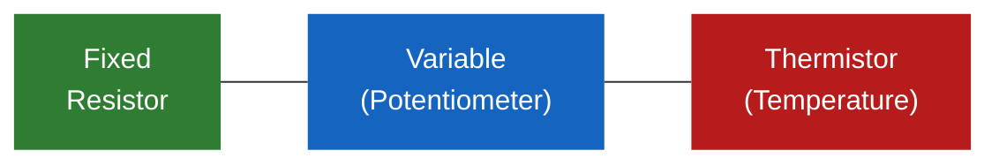
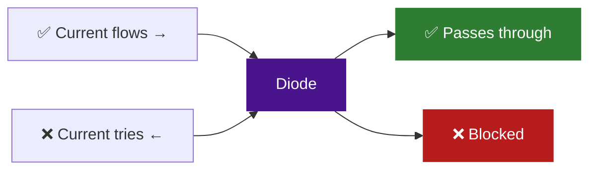
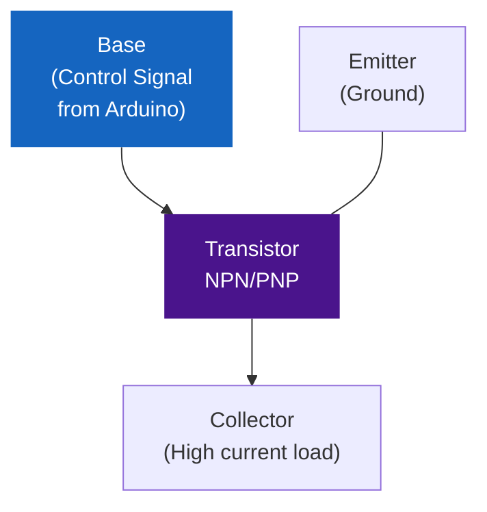
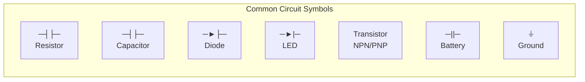
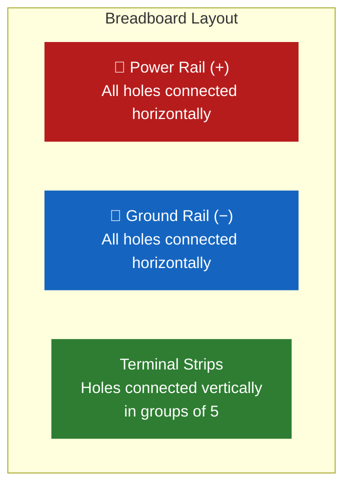

---
title: Lesson 02 — Electronic Components & Circuit Basics
description: Explore voltage, current, resistance, Ohm's Law, passive and active components, circuit diagrams, and breadboarding — the foundation of every electronics project.
---

# Lesson 02 — Electronic Components & Circuit Basics

<div class="grid cards" markdown>

-   ⏱️ **Duration**

    70 minutes

-   🎯 **Track**

    Robotics — Module 01

-   📊 **Difficulty**

    🟢 Beginner

-   📦 **Requires**

    Lesson 01 complete

</div>

---

## 🎯 Learning Objectives

!!! success "By the end of this lesson you will be able to:"

    - [x] Explain voltage, current, and resistance using real-world analogies
    - [x] Apply Ohm's Law to calculate values in a circuit
    - [x] Distinguish between series and parallel circuits
    - [x] Identify and describe common passive components — resistors, capacitors, diodes
    - [x] Identify and describe common active components — transistors, ICs
    - [x] Read a basic circuit diagram and trace current flow
    - [x] Build a simple circuit on a breadboard

---

## 🧠 What is Electronics?

Electronics is the foundation of every robot, Arduino project, and
embedded system you will ever build. Before you can wire a sensor or
control a motor, you need to understand the three fundamental forces
that govern every circuit.

!!! quote "The Analogy"
    Think of an electronic circuit like a **water pipe system**.

    - **Voltage** is the water pressure — it pushes charges through the wire
    - **Current** is the flow rate — how much water actually moves per second
    - **Resistance** is the pipe narrowing — it restricts how much can flow

    A pump (battery) creates pressure (voltage), water flows (current),
    and narrow pipes (resistors) slow it down.

---

## ⚡ 2.1 — Basic Electrical Concepts

### Voltage (V)

**Voltage** is the electric potential difference between two points.
It is the driving force that pushes electric charges through a conductor.

- **Unit:** Volt (V)
- **Symbol:** V
- **Example:** A 9V battery supplies 9 volts of potential difference

### Current (I)

**Current** is the flow of electric charge through a conductor —
how many charges pass a point per second.

- **Unit:** Ampere (A)
- **Symbol:** I
- **Example:** A 0.5A current flows through a typical LED circuit

### Resistance (R)

**Resistance** is the opposition a material offers to the flow of
electric current. It converts electrical energy into heat.

- **Unit:** Ohm (Ω)
- **Symbol:** R
- **Example:** A 220Ω resistor limits current to protect an LED

---

### Ohm's Law — The Most Important Formula in Electronics



**The formula:**

```
V = I × R       →   Voltage   = Current × Resistance
I = V ÷ R       →   Current   = Voltage ÷ Resistance
R = V ÷ I       →   Resistance = Voltage ÷ Current
```

**Worked example:**

```
Given:  R = 220Ω   and   V = 5V (Arduino output pin)
Find:   I = ?

I = V ÷ R
I = 5 ÷ 220
I = 0.023A = 23mA
```

!!! info "Why this matters for Arduino"
    An Arduino digital pin outputs 5V and can safely supply up to
    40mA of current. An LED needs about 20mA to glow brightly.
    Without a resistor, too much current flows and the LED burns out.
    Ohm's Law tells us exactly which resistor to use.

!!! example "Try this"
    If your battery is 9V and your resistor is 470Ω, what is the
    current flowing through the circuit?

    ??? tip "Solution"
        I = V ÷ R = 9 ÷ 470 = **0.019A = 19mA**

---

### Series vs Parallel Circuits

=== "🔗 Series Circuit"

    All components are connected **end-to-end** in a single path.

    ```mermaid
    flowchart LR
        BAT(["🔋 Battery\n9V"]) --> R1["Resistor 1\n100Ω"]
        R1 --> R2["Resistor 2\n100Ω"]
        R2 --> LED["💡 LED"]
        LED --> BAT

        style BAT fill:#f57f17,color:#fff,stroke:none
        style LED fill:#1565c0,color:#fff,stroke:none
    ```

    **Rules:**

    - Same current flows through every component
    - Voltage divides across each component
    - If one component fails → entire circuit breaks

    **Real-world example:** Old decorative string lights — one bulb
    blows and the whole string goes dark.

=== "⚡ Parallel Circuit"

    Components are connected **across the same voltage source**,
    each with its own path.

    ```mermaid
    flowchart LR
        BAT(["🔋 Battery\n9V"]) --> node1[ ]
        node1 --> LED1["💡 LED 1"]
        node1 --> LED2["💡 LED 2"]
        node1 --> LED3["💡 LED 3"]
        LED1 --> node2[ ]
        LED2 --> node2
        LED3 --> node2
        node2 --> BAT

        style BAT fill:#f57f17,color:#fff,stroke:none
        style LED1 fill:#1565c0,color:#fff,stroke:none
        style LED2 fill:#1565c0,color:#fff,stroke:none
        style LED3 fill:#1565c0,color:#fff,stroke:none
        style node1 fill:#333,stroke:none
        style node2 fill:#333,stroke:none
    ```

    **Rules:**

    - Voltage is the same across every branch
    - Current divides — each branch carries its share
    - If one component fails → others continue working

    **Real-world example:** Household wiring — one light fails,
    others stay on.

=== "Comparison"

    | Feature | Series | Parallel |
    |---|---|---|
    | Current | Same everywhere | Divides at junctions |
    | Voltage | Divides | Same across all |
    | One component fails | ❌ All stop | ✅ Others continue |
    | Example | Old string lights | House wiring |
    | Arduino use | LED chains | Multiple sensors |

---

## 🔩 2.2 — Passive Electronic Components

Passive components **do not require a power source** to function —
they only respond to the current and voltage applied to them.

### Resistors

**Function:** Limit or control current in a circuit.



| Type | Description | Arduino Use |
|---|---|---|
| **Fixed** | Set resistance value — never changes | Protect LEDs |
| **Potentiometer** | Variable — twist to change resistance | Volume knob, joystick |
| **Thermistor** | Resistance changes with temperature | Temperature sensing |

**Reading the Resistor Colour Code:**

```
Band 1   Band 2   Band 3 (Multiplier)   Band 4 (Tolerance)
  Red      Red         Brown                  Gold

  2    +   2    ×   10¹              = 220Ω  ±5%
```

| Colour | Digit | Multiplier |
|---|---|---|
| Black | 0 | ×1 |
| Brown | 1 | ×10 |
| Red | 2 | ×100 |
| Orange | 3 | ×1,000 |
| Yellow | 4 | ×10,000 |
| Green | 5 | ×100,000 |

!!! tip "Most common resistors in Arduino projects"
    `220Ω` — LED current limiting
    `10kΩ` — pull-up/pull-down for buttons
    `470Ω` — general purpose current limiting

---

### Capacitors

**Function:** Store and release electrical energy. Act like a tiny
rechargeable battery that charges and discharges very quickly.

| Type | Polarised? | Typical Values | Use Case |
|---|---|---|---|
| **Ceramic** | No | 1pF – 100nF | Noise filtering, timing |
| **Electrolytic** | Yes (+/- legs) | 1µF – 10,000µF | Power supply smoothing |

!!! warning "Electrolytic capacitors are polarised"
    The longer leg is positive (+). Connect the wrong way around
    and the capacitor can overheat or burst.

**Real example:** A 10µF electrolytic capacitor across your Arduino's
power supply smooths out voltage spikes and prevents resets.

---

### Diodes

**Function:** Allow current to flow in **one direction only** — like
a one-way valve for electricity.



| Type | Function | Example use |
|---|---|---|
| **Standard** | Passes current one way | Reverse polarity protection |
| **Zener** | Voltage regulation — clamps at fixed voltage | Power regulation |
| **LED** | Emits light when current flows | Indicators, displays |

**About LEDs:**

- Polarised — longer leg is positive (Anode), shorter is negative (Cathode)
- Typical forward voltage: 2V (red/green) to 3.4V (blue/white)
- **Always use a current-limiting resistor** — never connect directly to 5V

---

## 🔌 2.3 — Active Electronic Components

Active components **require a power source** to function — they can
amplify or switch signals.

### Transistors

**Function:** Work as a **switch** or **amplifier** in a circuit.
This is how a small signal from an Arduino can control a large load
like a motor.



| Terminal | Role |
|---|---|
| **Base** | Control input — small signal switches the transistor |
| **Collector** | Connected to the load (motor, high-power LED) |
| **Emitter** | Connected to ground |

**Real Arduino use:** An Arduino pin can only supply 40mA — not enough
for a motor. A transistor lets the Arduino use a tiny 5mA signal to
switch a 500mA motor circuit on and off.

=== "NPN Transistor"

    - Base HIGH → current flows Collector to Emitter → load turns ON
    - Most common type for Arduino projects
    - Example: BC547, 2N2222, TIP120

=== "PNP Transistor"

    - Base LOW → current flows Emitter to Collector → load turns ON
    - Less common in beginner projects
    - Logic is inverted compared to NPN

---

### Integrated Circuits (ICs)

**Definition:** A small chip containing many electronic components
(transistors, resistors, capacitors) built into one package.

| IC | Function | Arduino Use |
|---|---|---|
| **555 Timer** | Generates pulses and time delays | Blinking LEDs, tone generation |
| **Logic Gate ICs** | AND, OR, NOT operations | Signal processing |
| **L298N** | Dual H-Bridge motor driver | Control DC motors |
| **LM7805** | 5V voltage regulator | Stable power supply |

!!! info "ICs in your Arduino"
    The Arduino Uno itself contains an ATmega328P — an IC with a
    CPU, memory, and I/O all on one tiny chip. Everything you program
    runs inside that single component.

---

## 📐 2.4 — Reading Circuit Diagrams

Circuit diagrams (also called schematics) are the universal language
of electronics. They show exactly how components connect — regardless
of physical layout.

### Common Symbols



| Symbol | Component | What it does |
|---|---|---|
| `─┤├─` | Resistor | Limits current |
| `─┤┤─` | Capacitor | Stores charge |
| `─►├─` | Diode | One-way valve |
| `─►|─` | LED | Light emitting diode |
| `─||─` | Battery | Voltage source |
| `⏚` | Ground | 0V reference point |

### How to Read a Circuit Diagram

!!! abstract "3-step method"

    1. **Find the power source** — identify + and − (battery or VCC/GND)
    2. **Trace the current path** — follow the wire from + through
       components back to −
    3. **Identify each component** — name it and understand its role
       in the circuit

**Example — Basic LED circuit:**

```
+5V ──── Resistor (220Ω) ──── LED (+) ──── LED (−) ──── GND
```

Reading this:
- Power comes from 5V
- Resistor limits current to ~20mA
- Current enters LED at anode (+), exits at cathode (−)
- Returns to ground (GND)

---

### Breadboarding

A **breadboard** is a reusable platform for building and testing
electronic circuits without soldering.



**How it works:**

- **Power rails** (red/blue lines on the sides) — run horizontally
  the full length. Connect VCC to red, GND to blue.
- **Terminal strips** (main area) — holes connected vertically in
  groups of 5. The gap in the centre separates the two halves.

!!! warning "The centre gap matters"
    The two halves of the breadboard are electrically separate.
    An IC chip sits across this gap — each pin connects to its own
    column on opposite sides.

**Building the LED circuit on a breadboard:**

```
Arduino 5V pin → Red power rail
Arduino GND    → Blue ground rail
220Ω resistor  → from power rail to column A5
LED anode (+)  → column A6
LED cathode(−) → column A7 → jumper wire → blue ground rail
```

---

## 🛠️ Step-by-Step Activity

!!! info "What we are building"
    A **Component Identification Chart** — you will identify, classify,
    and document 5 real components from your kit.

**What you need:**

- [ ] Your electronics component kit
- [ ] Paper / digital table (or Google Sheets)
- [ ] Multimeter (optional — for measuring resistance)

---

**Step 1 — Pick 5 components**

Choose 5 components from your kit — try to include at least:

- 1 resistor · 1 capacitor · 1 LED · 1 transistor · 1 other

---

**Step 2 — Fill in this table for each component**

```
┌─────────────────────────────────────────────────────────────┐
│ Component Name :                                            │
│ Type           : Passive / Active                           │
│ Symbol         : (draw or describe)                         │
│ Function       : What does it do?                           │
│ Leads/Pins     : How many? Are any polarised?               │
│ Value          : (e.g., 220Ω, 10µF, NPN)                   │
│ Arduino Use    : How would you use this in a project?        │
└─────────────────────────────────────────────────────────────┘
```

---

**Step 3 — Draw the LED circuit**

Draw a schematic for this circuit using the symbols from Section 2.4:

```
5V → 220Ω resistor → LED → GND
```

Label every component with its name and value.

---

**Step 4 — Answer these questions**

```
1. If V = 5V and R = 220Ω, what is I?         I = ________
2. Is the LED circuit series or parallel?      ___________
3. Which component controls LED brightness?    ___________
4. What happens if you remove the resistor?    ___________
```

---

## 🏋️ Practice Exercise

!!! question "Exercise — Ohm's Law Calculator"

    **Without a computer — just pen and paper.**

    Solve all five problems using V = I × R:

    | Problem | Given | Find |
    |---|---|---|
    | 1 | V = 9V, R = 470Ω | I = ? |
    | 2 | V = 5V, I = 20mA | R = ? |
    | 3 | I = 0.1A, R = 100Ω | V = ? |
    | 4 | V = 12V, R = 1000Ω | I = ? |
    | 5 | V = 3.3V, I = 15mA | R = ? |

    ??? tip "Hint — click to reveal"
        Remember the triangle:

        ```
            [ V ]
           ────────
           [ I × R ]
        ```

        Cover the value you want to find — the remaining
        two show the formula to use.

        Also: 20mA = 0.020A · 15mA = 0.015A
        Always convert mA to A before calculating.

    ??? success "Answer Key — click to reveal"

        | Problem | Working | Answer |
        |---|---|---|
        | 1 | I = 9 ÷ 470 | **19.1mA** |
        | 2 | R = 5 ÷ 0.020 | **250Ω** |
        | 3 | V = 0.1 × 100 | **10V** |
        | 4 | I = 12 ÷ 1000 | **12mA** |
        | 5 | R = 3.3 ÷ 0.015 | **220Ω** |

---

## 🔥 Challenge

!!! danger "Challenge — Circuit Design Problem"

    **Design an LED circuit for the following specification:**

    - Power supply: 9V battery
    - LED forward voltage: 2V (red LED)
    - LED desired current: 20mA
    - Two LEDs wired in parallel (both must light up)

    **Your answer must include:**

    1. The resistor value needed for each LED (use Ohm's Law)
    2. A drawn schematic showing both LEDs in parallel with their resistors
    3. The total current drawn from the 9V battery
    4. Whether this is safe for the battery (typical 9V can supply ~500mA)

    ??? tip "Starting hint"
        Voltage across resistor = Battery voltage − LED forward voltage
        = 9V − 2V = 7V

        Use this 7V with your target current to find the resistor.
        In parallel, each LED needs its **own** resistor.

---

## 🧪 Quick Quiz

!!! question "Test yourself — no looking back"

    **1.** What is Ohm's Law?

    - A) V = I + R
    - B) V = I × R
    - C) V = I − R
    - D) V = I ÷ R

    ---

    **2.** A resistor has bands: Red · Red · Brown · Gold.
    What is its resistance value?

    - A) 22Ω
    - B) 2200Ω
    - C) 220Ω
    - D) 22kΩ

    ---

    **3.** Which component allows current to flow in ONE direction only?

    - A) Resistor
    - B) Capacitor
    - C) Transistor
    - D) Diode

    ---

    **4.** In a parallel circuit, what happens to the voltage
    across each branch?

    - A) It divides equally
    - B) It stays the same across all branches
    - C) It doubles
    - D) It drops to zero

    ---

    **5.** An Arduino pin outputs 5V. You want 20mA through an LED.
    What resistor value do you need?

    ??? success "Answer Key — click to reveal"

        | # | Answer | Explanation |
        |---|--------|-------------|
        | 1 | **B** V = I × R | Voltage = Current × Resistance — the fundamental law |
        | 2 | **C** 220Ω | Red(2) · Red(2) · Brown(×10) = 220Ω · Gold = ±5% tolerance |
        | 3 | **D** Diode | Diodes are one-way valves — LEDs are a type of diode |
        | 4 | **B** Same across all | Voltage is constant in parallel — current divides |
        | 5 | R = 5 ÷ 0.020 = **250Ω** | Nearest standard value: 220Ω or 270Ω |

---

## 🌐 Real-World Connection

Every electronic device you use today is built from the same
components you studied in this lesson:

- **Resistors** — inside every circuit board on the planet, limiting
  current and setting voltage levels
- **Capacitors** — in your phone's power circuit, smoothing the
  battery output 1000 times per second
- **Transistors** — your phone's processor contains **billions** of
  transistors switching at 3GHz
- **ICs** — the Arduino Uno, your laptop's CPU, your TV's remote —
  all are ICs built from transistors, resistors, and capacitors
- **LEDs** — in every display, indicator light, traffic signal, and
  LED bulb worldwide

When you wire your first LED circuit on a breadboard, you are working
with the exact same principles that engineers use to design spacecraft,
medical devices, and AI chips.

---

## 📝 Lesson Summary

| Concept | Key Detail | Quick Example |
|---|---|---|
| **Voltage (V)** | Electric potential — drives current | 9V battery |
| **Current (I)** | Flow of charge — measured in Amperes | 20mA through LED |
| **Resistance (R)** | Opposition to flow — measured in Ohms | 220Ω resistor |
| **Ohm's Law** | V = I × R | 5V ÷ 220Ω = 23mA |
| **Series circuit** | Same current, voltage divides | String lights |
| **Parallel circuit** | Same voltage, current divides | House wiring |
| **Resistor** | Limits current | Protects LED |
| **Capacitor** | Stores and releases charge | Power smoothing |
| **Diode** | One-direction current flow | Reverse protection |
| **Transistor** | Switch or amplifier | Control a motor from Arduino |
| **IC** | Many components in one chip | 555 Timer, ATmega328P |
| **Breadboard** | Reusable circuit building platform | Prototype circuits |

**Key takeaways:**

- 📌 **V = I × R** — memorise this. You will use it in every project
- 📌 Always use a **current-limiting resistor** with every LED
- 📌 **Passive** components need no power source — **active** ones do
- 📌 A **breadboard** lets you test circuits without any soldering

---

## ✅ Before Moving On

!!! success "Confirm all four before going to Lesson 03"

    - [x] I can solve Ohm's Law problems (V, I, and R)
    - [x] I can identify resistors, capacitors, diodes, LEDs, and transistors
    - [x] I completed the component identification activity
    - [x] I can explain the difference between series and parallel circuits

---

## ➡️ Next Lesson

**Lesson 03** covers **Arduino Setup & Your First Program** — installing
the Arduino IDE, understanding the board layout, and uploading your first
sketch to real hardware.

[Lesson 03 — Arduino Setup :octicons-arrow-right-24:](lesson-03.md)

---

*Lesson 02 of 04 · Robotics Track · Module 01 — Foundations · Code & Core Learning System*